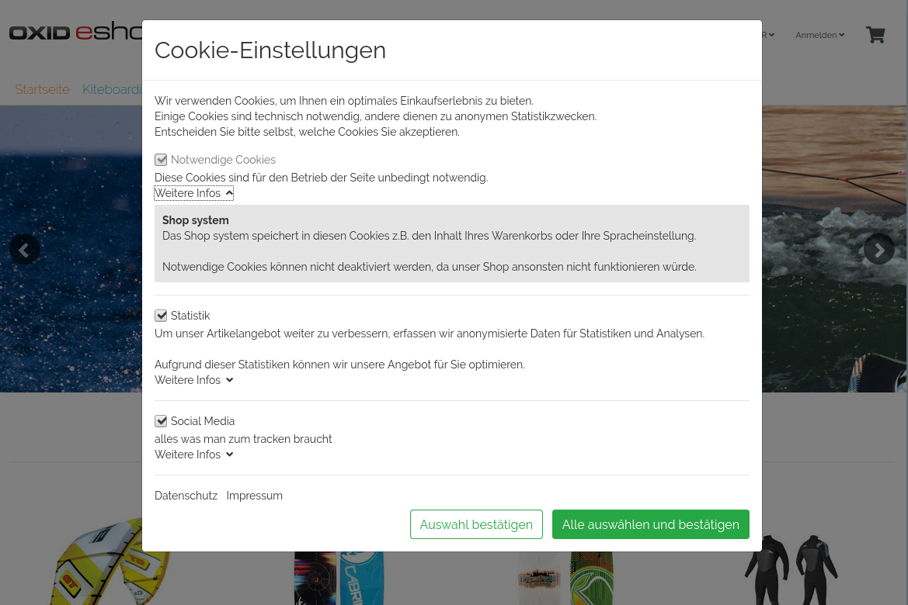

# Oxid Cookie Manager

## Description

Implement the cookie manager solution with popup.
Manage all cookies you need in the oxid admin. Add code snippets simply without template changes.
Enable/Disable cookies based on the language the user select in the shop frontend.
Goup cookies, define required cookies. The system create a popup automaticly.

For the legal security we do not take over guarantee!

**Technic behind:**

If the user enter the page the first time, the system test if a special cookie set on the computer 
the user use. If no cookie present, the system won`t display cookies the system manage. The system collect
all information and display a popup to the user where he can select cookies he like to allow. After the user
agree the cookie settings, the page will reload and display only the cookies the user allowed. For this, a cookie
will save on the computer the user use to identify in the future if the user agreed or not. In the database, 
the modul save the settings the user make, so in the future it will only add the cookies to the page which 
agreed by the user.

This extension was created for Oxid 6.x. (Wave theme)

## Requirements

"oxid-formedit" module required.

## Install

1. Copy module into following directory
        
        source/modules/rs/cookiemanager
        
2. Add following to composer.json on the shop root

        "autoload": {
            "psr-4": {
                "rs\\cookiemanager\\": "./source/modules/rs/cookiemanager"
            }
        },
    
3. Refresh autoloader files with composer in the oxid root directory.

        composer dump-autoload

4. Execute following statments on the database

        CREATE TABLE `rs_cookie_manager` (
        `oxid` char(32) CHARACTER SET latin1 COLLATE latin1_general_ci NOT NULL,
        `f_rs_cookie_manager_group` char(32) CHARACTER SET latin1 COLLATE latin1_general_ci DEFAULT NULL,
        `rsactive` tinyint(1) NOT NULL DEFAULT '0',
        `rsident` varchar(250) DEFAULT NULL,
        `rstitle` varchar(250) DEFAULT NULL,
        `rstitle_1` varchar(250) DEFAULT NULL,
        `rstitle_2` varchar(250) DEFAULT NULL,
        `rsdescription` varchar(2000) DEFAULT NULL,
        `rsdescription_1` varchar(2000) DEFAULT NULL,
        `rsdescription_2` text,
        PRIMARY KEY (`oxid`),
        KEY `f_rs_cookie_manager_group` (`f_rs_cookie_manager_group`)
        ) ENGINE=InnoDB DEFAULT CHARSET=utf8;

        CREATE TABLE `rs_cookie_manager_group` (
        `oxid` char(32) CHARACTER SET latin1 COLLATE latin1_general_ci NOT NULL,
        `rsident` varchar(250) DEFAULT NULL,
        `rstitle` varchar(250) DEFAULT NULL,
        `rstitle_1` varchar(250) DEFAULT NULL,
        `rstitle_2` varchar(250) DEFAULT NULL,
        `rsdescription` text,
        `rsdescription_1` text,
        `rsdescription_2` text,
        `rsrequired` tinyint(1) DEFAULT '0',
        `rsorder` int(11) DEFAULT '0',
        PRIMARY KEY (`oxid`)
        ) ENGINE=InnoDB DEFAULT CHARSET=utf8;

        CREATE TABLE `rs_cookie_manager_item` (
        `oxid` char(32) CHARACTER SET latin1 COLLATE latin1_general_ci NOT NULL,
        `f_rs_cookie_manager` char(32) CHARACTER SET latin1 COLLATE latin1_general_ci DEFAULT NULL,
        `rsactive` tinyint(1) DEFAULT '0',
        `rsactive_1` tinyint(1) NOT NULL DEFAULT '0',
        `rsactive_2` tinyint(1) NOT NULL DEFAULT '0',
        `rsview_classes` text,
        `rsplace1` text,
        `rsplace3` text,
        `rsplace2` text,
        PRIMARY KEY (`oxid`),
        KEY `f_rs_cookie_manager` (`f_rs_cookie_manager`)
        ) ENGINE=InnoDB DEFAULT CHARSET=utf8;

        CREATE TABLE `rs_cookie_manager_track` (
        `oxid` char(32) CHARACTER SET latin1 COLLATE latin1_general_ci NOT NULL,
        `rscreated` datetime NOT NULL DEFAULT CURRENT_TIMESTAMP,
        `rscookie_id` char(50) DEFAULT NULL,
        `f_rs_cookie_manager` char(32) CHARACTER SET latin1 COLLATE latin1_general_ci DEFAULT NULL,
        `rsshopid` int(11) NOT NULL DEFAULT '0',
        `rslanguageid` int(11) NOT NULL DEFAULT '0',
        `rsallow` tinyint(1) NOT NULL DEFAULT '0',
        PRIMARY KEY (`oxid`),
        KEY `f_rs_cookie_manager` (`f_rs_cookie_manager`)
        ) ENGINE=InnoDB DEFAULT CHARSET=utf8;

        INSERT INTO `rs_cookie_manager_group` (`oxid`, `rsident`, `rstitle`, `rstitle_1`, `rstitle_2`, `rsdescription`, `rsdescription_1`, `rsdescription_2`, `rsrequired`, `rsorder`) 
        VALUES
        ('rs_nessesary', 'Notwendig', 'Notwendige Cookies', NULL, NULL, 'Diese Cookies sind für den Betrieb der Seite unbedingt notwendig.', NULL, NULL, 1, 0),
        ('rs_statistic', 'Statistik', 'Statistik', NULL, NULL, 'Um unser Artikelangebot weiter zu verbessern, erfassen wir anonymisierte Daten für Statistiken und Analysen.\r\n\r\nAufgrund dieser Statistiken können wir unsere Angebot für Sie optimieren.', NULL, NULL, 0, 1);

        INSERT INTO `rs_cookie_manager` (`oxid`, `f_rs_cookie_manager_group`, `rsactive`, `rsident`, `rstitle`, `rstitle_1`, `rstitle_2`, `rsdescription`, `rsdescription_1`, `rsdescription_2`) 
        VALUES
        ('rs_google_analytics', 'rs_nessesary', 1, 'Google analytics', 'Google analytics', NULL, NULL, 'Wir können Ihnen personalisierte Inhalte, passend zu Ihren Interessen anzuzeigen.\r\n\r\nSomit können wir Ihnen Angebote präsentieren, die für Sie besonders relevant sind.', NULL, NULL),
        ('rs_shop', 'rs_statistic', 1, 'Shop', 'Shop system', NULL, NULL, 'Das Shop system speichert in diesen Cookies z.B. den Inhalt Ihres Warenkorbs oder Ihre Spracheinstellung.\r\n\r\nNotwendige Cookies können nicht deaktiviert werden, da unser Shop ansonsten nicht funktionieren würde.', NULL, NULL);
        
5. Make following changes template changes:

    1. /source/Application/views/wave/tpl/layout/base.tpl right before &lt;/head&gt;

            [{/if}]
            [{* rs cookie manager start *}]
            [{block name="rscookiemanager1"}][{/block}]
            [{* rs cookie manager end *}]
            </head>

    2. /source/Application/views/wave/tpl/layout/base.tpl right after &lt;body ...&gt;

            <body class="cl-[{$oView->getClassName()}][{if $smarty.get.plain == '1'}] popup[{/if}][{if $blIsCheckout}] is-checkout[{/if}][{if $oxcmp_user && $oxcmp_user->oxuser__oxpassword->value}] is-logged-in[{/if}]">
            [{* rs cookie manager *}]
            [{block name="rscookiemanager2"}][{/block}]
            [{* rs cookie manager end *}]

    3. /source/Application/views/wave/tpl/layout/base.tpl right before &lt;/body&gt;
    
            [{* rs cookie manager *}]
            [{block name="rscookiemanager3"}][{/block}]
            [{* rs cookie manager end *}]
            </body>
            </html>

6. Enable module in the oxid admin area, Extensions => Modules

7. Rebuild views, clear complete cache.